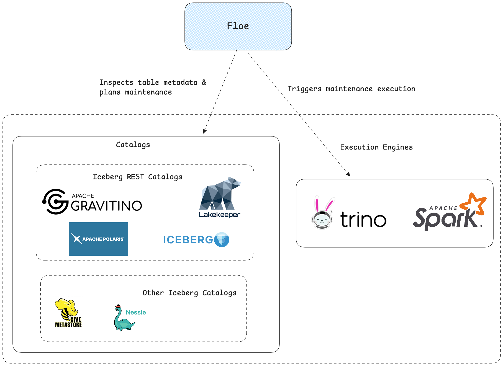

# Floe

Floe is a policy-based table maintenance system for Apache Iceberg. *(A floe is a sheet of floating ice.)*

[](https://github.com/nssalian/floe/actions/workflows/ci.yml)
[](https://opensource.org/licenses/Apache-2.0)

Floe automates compaction, snapshot expiration, orphan cleanup, and manifest optimization through declarative policies. 
It orchestrates maintenance using Iceberg's built-in procedures via Spark or Trino.


## High Level Architecture



## Quick Start

```bash
# Starts up a Floe server without a catalog or engine
git clone https://github.com/nssalian/floe.git
cd floe
make start
```

Open http://localhost:9091 and explore the API or UI.

## Full Example Setups

```bash
make example-rest       # Iceberg REST Catalog (Vanilla)
make example-polaris    # Apache Polaris
make example-lakekeeper # Lakekeeper
make example-gravitino  # Gravitino
make example-hms        # Hive Metastore
make example-nessie     # Project Nessie

# Swap execution engine by running make example-<catalog>-trino default is Spark
# Run a make clean to stop and remove containers before starting a new example
```

## Features

- **Policy-driven** - Define maintenance rules that match tables by glob pattern
- **Scheduled** - Cron-based scheduling support as well as manual triggering
- **Multi-catalog** - Iceberg REST Catalogs (Polaris, Lakekeeper, Gravitino, DataHub), Hive, and Nessie are supported
- **Multi-engine** - Spark (via Livy), Trino
- **Pluggable** - Swap catalogs, engines, and storage backends

## Supported Operations

| Operation | Description |
|-----------|-------------|
| `REWRITE_DATA_FILES` | Compact small files |
| `EXPIRE_SNAPSHOTS` | Remove old snapshots |
| `REMOVE_ORPHAN_FILES` | Delete unreferenced files |
| `REWRITE_MANIFESTS` | Optimize manifest files |

## Create a Policy in any of the Example Setups

```bash
curl -s -X POST "http://localhost:9091/api/v1/policies" \
  -H "Content-Type: application/json" \
  -d '{
    "name": "orders-compaction-policy",
    "description": "Compact small files in orders table",
    "enabled": true,
    "tablePattern": "demo.test.orders",
    "priority": 100,
    "rewriteDataFiles": {
      "strategy": "BINPACK",
      "targetFileSizeBytes": 134217728
    }
  }'
```

## Run a Maintenance Operation in any of the Example Setups

```bash
curl -X POST http://localhost:9091/api/v1/maintenance/trigger \
  -H "Content-Type: application/json" \
  -d '{
    "catalog": "demo",
    "namespace": "test",
    "table": "orders",
    "policyName": "orders-compaction-policy"
}'
```

## Project Status

Floe works as documented. Forks are welcome.

## License

Apache License 2.0
