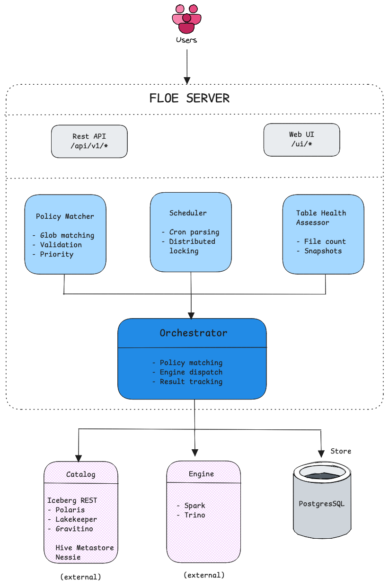
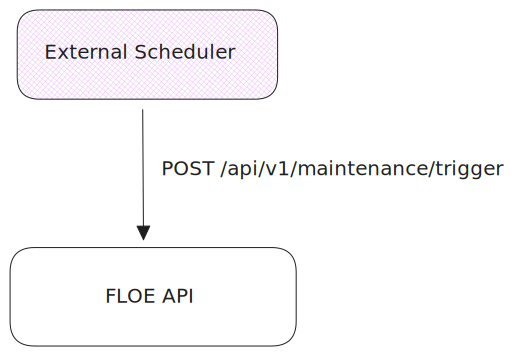

# Architecture

Floe is a modular platform for Apache Iceberg table maintenance. Every core component can be swapped to integrate with your infrastructure.

## System Architecture

{width="600"}

## Extension Points

External integrations are pluggable with configuration:

| Component | Interface | Implementations |
|-----------|-----------|-----------------|
| **Catalog** | `CatalogClient` | Iceberg REST, Hive, Nessie, Polaris, Lakekeeper, Gravitino |
| **Engine** | `ExecutionEngine` | Spark, Trino |
| **Store** | `PolicyStore`, `OperationStore` | PostgreSQL, Memory |

## For External Scheduler Integration

Disable the built-in scheduler and trigger maintenance via API:

{width="600"}

```bash
# Disable built-in scheduler
# The demos enable the scheduler by default
FLOE_SCHEDULER_ENABLED=false

# Trigger from external orchestrator
curl -X POST http://floe:9091/api/v1/maintenance/trigger \
  -d '{"catalog": "demo", "namespace": "db", "table": "events"}'
```

## Data Flow

```
    1. Policy Created (if table matches)
           |
           v
    2. Scheduler triggers (or API call)
           |
           v
    3. Orchestrator matches tables
           |
           v
    4. Engine executes maintenance (Spark or Trino)
           |
           +--> Spark: rewriteDataFiles(), expireSnapshots(),
           |           deleteOrphanFiles(), rewriteManifests()
           |
           +--> Trino: ALTER TABLE ... EXECUTE optimize,
           |           expire_snapshots, remove_orphan_files
           |
           v
    5. Operation recorded in Store
           |
           v
    6. Event emitted (logging)
```

## Learn More

- [Scheduler](scheduler.md) - Cron schedules and distributed locking
- [Engines](../engines/index.md) - Spark and Trino configuration
- [Catalogs](../catalogs/index.md) - Catalog setup
- [Monitoring](../operations/monitoring.md) - Metrics and health checks
