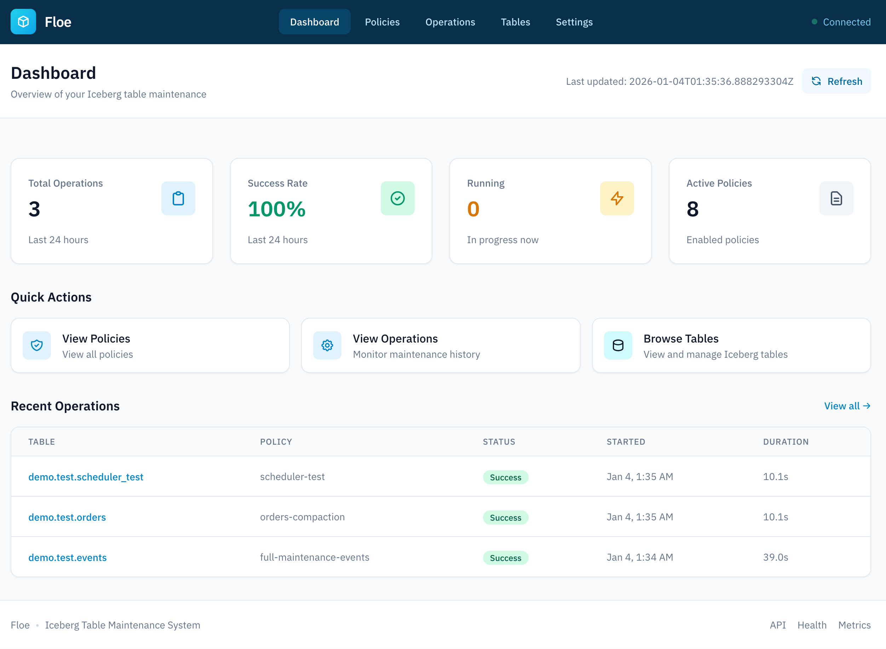
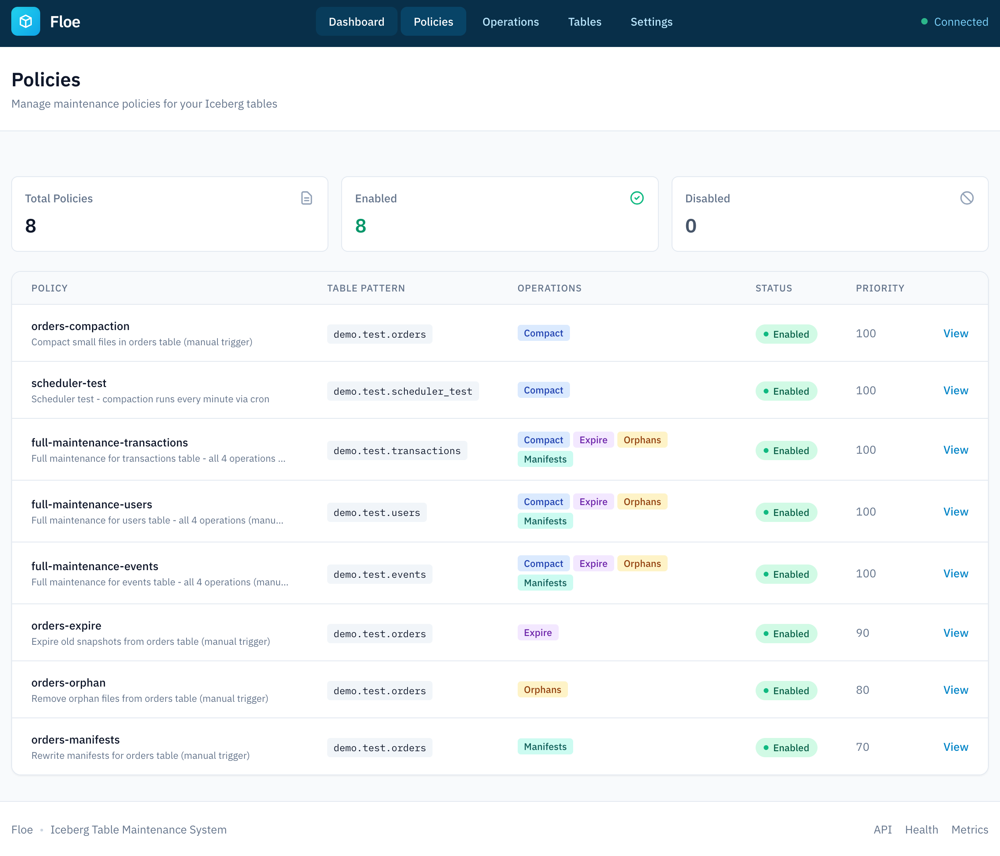
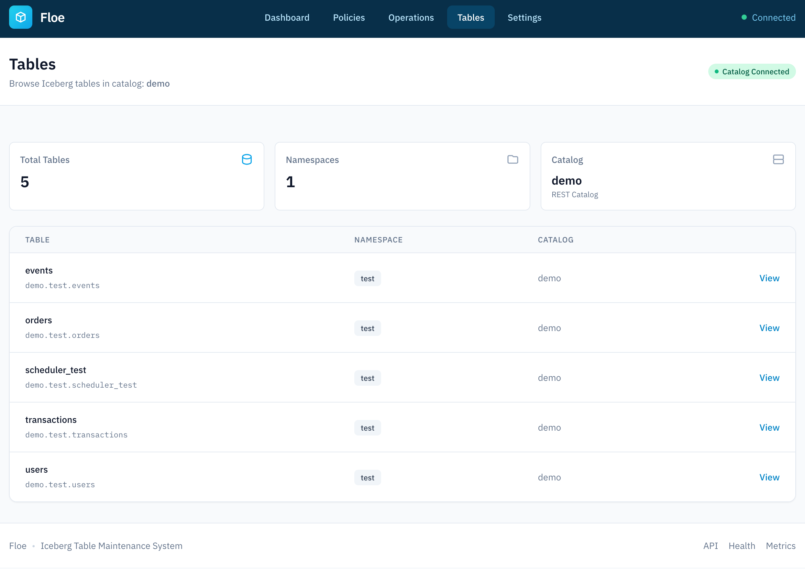
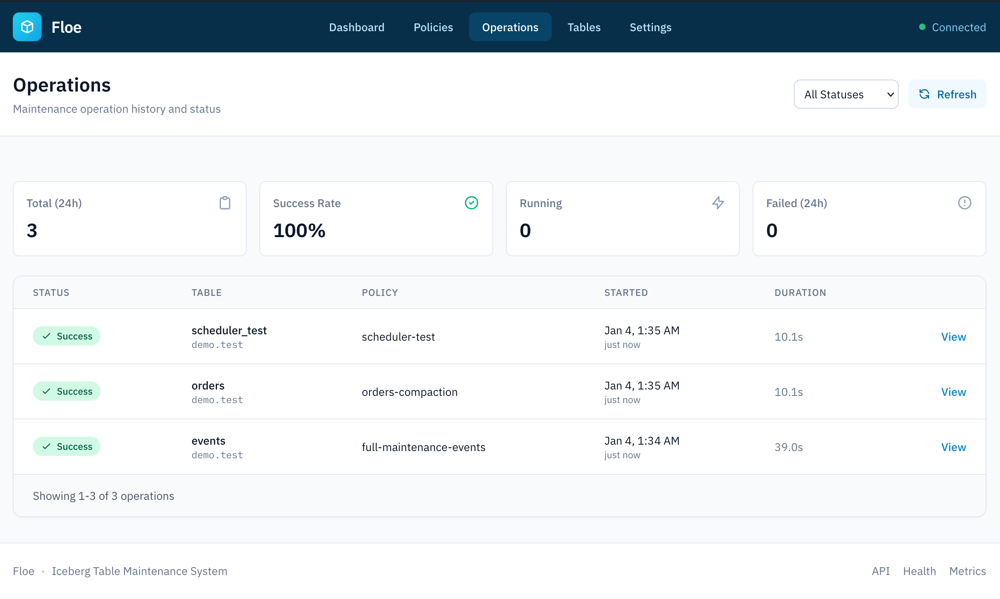
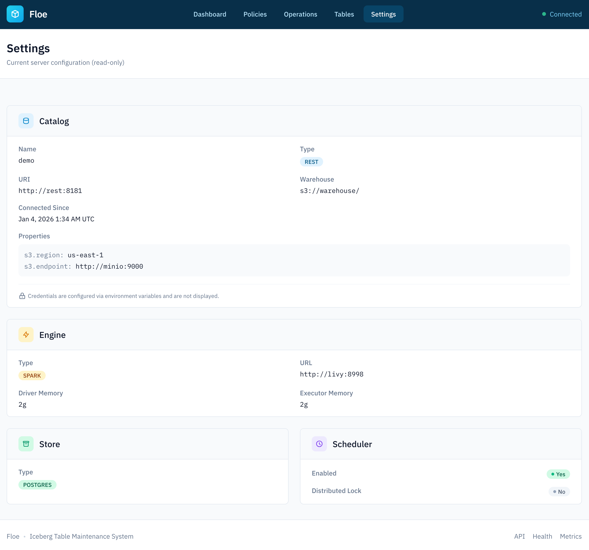

# Dashboard

Floe provides a read-only web dashboard for monitoring policies, tables, and maintenance operations.

## Accessing the Dashboard

The dashboard is available at:

```
http://localhost:9091
or 
http://localhost:9091/ui
```

Note: "Read-Only Interface"
    The dashboard is intentionally read-only. All policy management must be done through the API.
---

## Dashboard Views

### Home

The home page displays a system overview:

- Total policies count
- Active operations
- Recent maintenance activity
- System health status

{width="700"}

### Policies

View all configured policies at `/ui/policies`:

| Column | Description |
|--------|-------------|
| Name | Policy identifier |
| Description | Human-readable description |
| Table Pattern | Glob pattern for matching tables |
| Status | Enabled/Disabled |
| Operations | Configured operations (icons) |
| Priority | Execution priority |

Click on a policy to see detailed configuration including:

- Full table pattern
- Created/updated timestamps
- All operation configurations with thresholds
- Matching tables

{width="700"}

### Tables

Browse discovered tables at `/ui/tables`:

- Table names from all configured catalogs
- Catalog and namespace organization
- Filter and search functionality
- Last maintenance timestamp

{width="700"}

### Operations

View maintenance operation history at `/ui/operations`:

| Column | Description |
|--------|-------------|
| Operation | Type (Compact, Expire, etc.) |
| Table | Target table name |
| Status | Running, Completed, Failed |
| Started | Operation start time |
| Duration | Execution duration |
| Files | Files processed/rewritten |

Filter operations by:

- Status (Running, Completed, Failed)
- Operation type
- Time range
- Table name


{width="700"}

---

### Settings

View system settings at `/ui/settings`:

- Configured catalogs
- Engine settings
- Floe Store settings
- Scheduler configuration

{width="700"}

---

## API Documentation

Interactive API documentation (Swagger UI) is available at:

```
http://localhost:9091/api
```