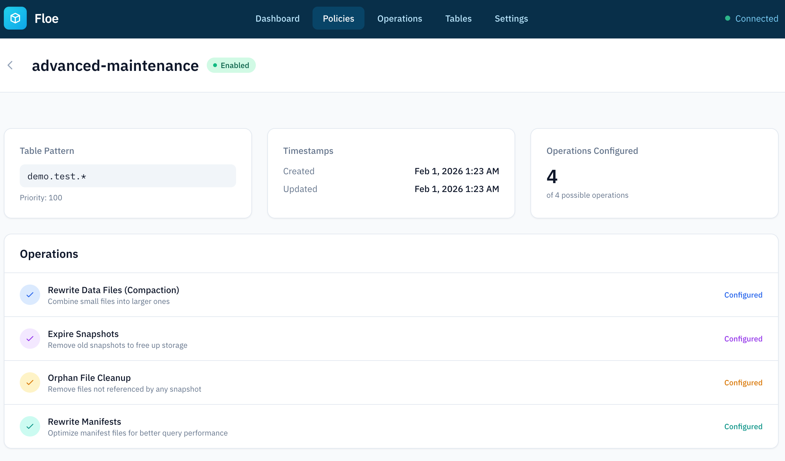
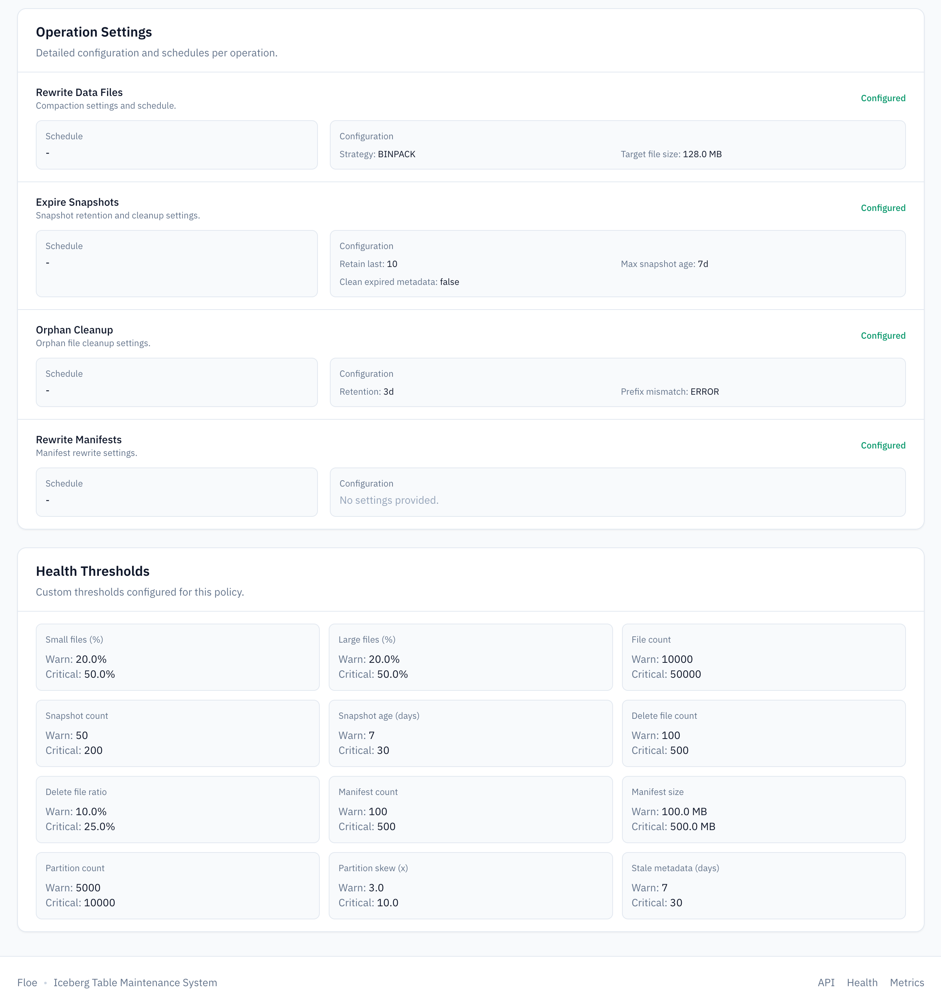
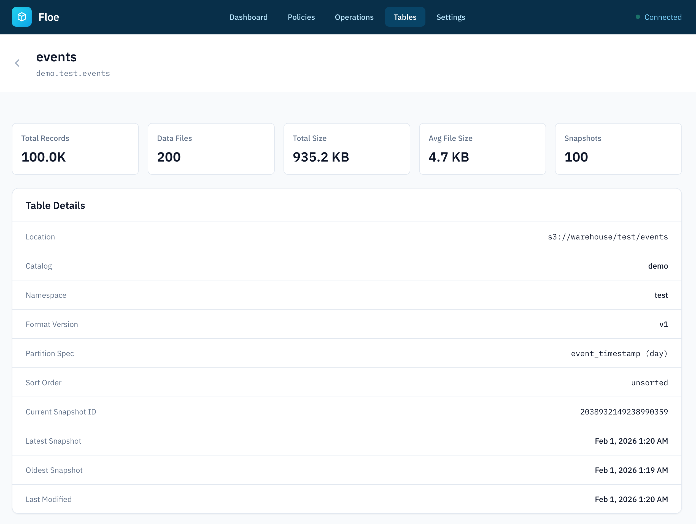

# Dashboard

Floe provides a web dashboard for monitoring policies, tables, and maintenance operations.

## Accessing the Dashboard

The dashboard is available at:

```
http://localhost:9091
or 
http://localhost:9091/ui
```

Note: Policy management is API-driven. The UI supports limited actions (manual triggers).
---

## Dashboard Views

### Home

The home page displays a system overview:

- Total policies count
- Active operations
- Recent maintenance activity
- System health status

{width="700"}

### Policies

View all configured policies at `/ui/policies`:

| Column | Description |
|--------|-------------|
| Name | Policy identifier |
| Table Pattern | Glob pattern for matching tables |
| Operations | Configured operations |
| Status | Enabled/Disabled |
| Priority | Execution priority |

{width="700"}

#### Policy detail view

Overview and configured operations:

{width="700"}

Operation settings and health thresholds:

{width="700"}


### Tables

Browse discovered tables at `/ui/tables`:

- Table names from all configured catalogs
- Catalog and namespace organization
    - Table details and health trends
- Health trend and recommended maintenance
- Auto-mode status (debt score, throttling, backoff)
- Scan mode and thresholds used for assessment

{width="700"}

#### Table detail view

Summary metrics and core table metadata:

{width="700"}

Health assessment, auto-mode status, thresholds, and recommendations:

{width="700"}

### Operations

View maintenance operation history at `/ui/operations`:

| Column | Description |
|--------|-------------|
| Status | Running, Completed, Failed |
| Table | Target table name |
| Policy | Policy name |
| Engine | Spark or Trino |
| Started | Operation start time |
| Duration | Execution duration |
| Actions | View operation details |

Filter operations by status.


{width="700"}

---

### Settings

View system settings at `/ui/settings`:

- Configured catalogs
- Engine settings
- Floe Store settings
- Scheduler configuration

{width="700"}

---

## API Documentation

Interactive API documentation (Swagger UI) is available at:

```
http://localhost:9091/api
```
