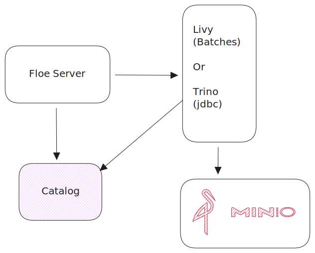
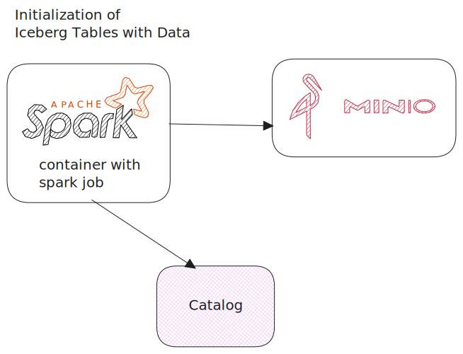

# Floe Examples

This directory contains Docker Compose examples for running Floe with different configurations.
These are only intended for illustration, development and testing purposes and not for production use.

> **Security Note**: All catalog examples run with `FLOE_AUTH_ENABLED=false` for simplicity.

## Catalog Options

| Catalog | Description | Best For |
|---------|-------------|----------|
| [rest-catalog](./rest-catalog/) | Apache Iceberg REST Catalog | Local development, testing |
| [nessie](./nessie/) | Project Nessie (Git-like versioning) | Version control, branching workflows |
| [polaris](./polaris/) | Apache Polaris (Snowflake Open Catalog) | Multi-engine access control |
| [hive-metastore](hms/) | Hive Metastore Service | Legacy Hive compatibility |

## Prerequisites

- Docker and Docker Compose v2+
- 8GB+ RAM available for Docker

## Architecture

All examples share the same architecture:



## Running examples



Note: The examples run demo setup scripts that create sample Iceberg tables and policies for testing.
See [setup-demo-tables](../scripts/setup-demo-tables.py) and [setup-demo-policies.sh](../scripts/setup-demo-policies.sh). 
The examples can be imagined as a typical Floe setup with a specific catalog and either Spark or Trino as the execution engine.
There is a `scheduler-test` operation that triggers every minute for demo purposes. 
To disable it, delete the `scheduler-test` policy using the API.

To skip demo setup:

```bash
  SKIP_DEMO=1 make example-<catalog-name> # e.g. rest, nessie, polaris, hive
```

1. Pick one of the following:
   > **Note:** If switching between examples, run `make clean` to remove existing containers and volumes. Expect some delay on first run as 
   > images are pulled and demo data is set up. Please run only one example at a time to avoid port conflicts.
   > 
   **Spark engine (default):**
   ```bash
   # Uses pre-built Floe images from GitHub Container Registry
   make example-rest         # REST Catalog + Spark
   make example-nessie       # Project Nessie + Spark
   make example-polaris      # Apache Polaris + Spark
   make example-hms          # Hive Metastore + Spark
   ```

   **Trino engine:**
   ```bash
   # Uses pre-built Floe images from GitHub Container Registry
   make example-rest-trino    # REST Catalog + Trino
   make example-nessie-trino  # Project Nessie + Trino
   make example-polaris-trino # Apache Polaris + Trino
   make example-hms-trino     # Hive Metastore + Trino
   ```

   **Local builds: (if you'd like to make changes)**
   ```bash
   # Make sure JDK is 21 and JAVA_HOME is set accordingly
   # Modify the following image tags in Makefile since those are the build tags
   #FLOE_IMAGE ?= floe:local
   #FLOE_LIVY_IMAGE ?= floe-livy:local
   # This will build the latest Floe and Livy images locally and use them in the example
   make example-rest-spark-local   # Build + REST Catalog + Spark
   make example-rest-trino-local   # Build + REST Catalog + Trino
   # Same pattern for other catalogs: example-<catalog>-<engine>-local
   ```

2. Navigate to Floe and explore the UI or API:
   - UI: http://localhost:9091
   - API: http://localhost:9091/api
   - Trino UI (if using Trino engine): http://localhost:8085
   - Livy UI (if using Spark engine): http://localhost:8998
   - Policies Tab: View the demo policies created
   - Tables Tab: View the demo tables created
   - Operations Tab: Monitor maintenance operations
   - Settings Tab: View Floe configuration
   
3. Trigger maintenance and monitor in the Operations tab:
   ```bash
   curl -X POST http://localhost:9091/api/v1/maintenance/trigger \
     -H 'Content-Type: application/json' \
     -d '{"catalog":"demo","namespace":"test","table":"events"}'
   ```

4. When done:
   ```bash
   make clean
   ```

5. (Optional) Add your own tables or more data, by editing [`scripts/setup-demo-tables.py`](../scripts/setup-demo-tables.py) and re-running on the Spark container. The data is intentionally 
minimal for demo purposes.
   ```bash
   docker exec -it $(docker ps --format '{{.Names}}' | grep spark) \
     spark-submit --master local[*] /tmp/setup-demo-tables.py
   ```


## Engine Configuration

**Livy (Spark)**: Works with all catalogs. Floe sends catalog configuration
in each Spark job request, so no per-catalog Livy configuration is needed.

**Trino**: Requires catalog-specific configuration. Each example includes the appropriate
Trino catalog properties file.

## Troubleshooting

### Services won't start
Check Docker has enough memory allocated (8GB+ recommended).

### Floe can't connect to catalog
Ensure the catalog service is healthy: `docker compose ps`

### Spark jobs fail
Check Livy logs: `docker compose logs <catalog>-livy`
or Livy UI: `http://localhost:8998`

### Trino queries fail
Check Trino logs: `docker compose logs <catalog>-trino`
or Trino UI: `http://localhost:8085` - `admin` user, no password